# LinkedIn Simulation — Distributed Systems Class Project

Full-stack LinkedIn clone built as a distributed systems course project. Eight FastAPI microservices, React frontend, Kafka-first async flows, Redis caching, MySQL + MongoDB persistence, AI Career Coach, and JMeter performance benchmarks.

---

## Team

| Person | Name | Responsibilities |
|--------|------|-----------------|
| Person 1 | Nikhil Khaneja | Kafka-first flows, auth/infra, exception handling, notifications, AWS Terraform |
| Person 2 | Shreya | AI Career Coach, AI evaluation metrics, outreach drafts |
| Person 3 | Drashti | Salary filter, FULLTEXT job search, low-traction chart, 10k dataset loader |
| Person 4 | Sanjay | JMeter benchmarks, ECS task definitions, performance analysis |

---

## Architecture

## Current State (May 2026)

- Recruiter hiring charts are now recruiter-scoped (top jobs/views/saves only for jobs posted by that recruiter).
- Member "Applications by status" pie chart now uses latest status per application (no multi-count inflation across transitions).
- AI ranked candidate "character chip" issue fixed by normalizing list-like fields from LLM payloads.
- Resume/media links normalized for HTTPS/ALB routing in recruiter and profile pages.
- Navigation cleanup done (removed `Home` and `Perf` entries from top nav).

## High-Level System Diagram

```mermaid
flowchart LR
    UI[React Frontend :5173] --> ALB[ALB / Nginx ingress]
    ALB --> AUTH[auth_service :8001]
    ALB --> MEMBER[member_profile_service :8002]
    ALB --> RECRUITER[recruiter_company_service :8003]
    ALB --> JOBS[jobs_service :8004]
    ALB --> APPS[applications_service :8005]
    ALB --> MSG[messaging_connections_service :8006]
    ALB --> ANALYTICS[analytics_service :8007]
    ALB --> AI[ai_orchestrator_service :8008]

    AUTH --> MYSQL[(MySQL)]
    MEMBER --> MYSQL
    RECRUITER --> MYSQL
    JOBS --> MYSQL
    APPS --> MYSQL
    MSG --> MYSQL
    ANALYTICS --> MYSQL
    AI --> MYSQL

    MSG --> MONGO[(MongoDB)]
    ANALYTICS --> MONGO
    AI --> MONGO

    AUTH --> REDIS[(Redis cache)]
    MEMBER --> REDIS
    JOBS --> REDIS
    MSG --> REDIS
    ANALYTICS --> REDIS
    AI --> REDIS

    APPS --> KAFKA[(Kafka)]
    JOBS --> KAFKA
    MSG --> KAFKA
    ANALYTICS --> KAFKA
    MEMBER --> KAFKA
    AI --> KAFKA
```

**Kafka-first example path:**
`POST /applications/submit` -> emit `application.submit.requested` -> async consumer persists application -> emit `application.submitted` -> analytics rollups update -> UI reads from query APIs.

## Service Catalog (Detailed)

### `auth_service` (`:8001`)
- **Primary responsibility:** identity and session lifecycle.
- **Owns data:** `users`, `refresh_tokens`.
- **Key APIs:** `/auth/register`, `/auth/login`, `/auth/refresh`, `/auth/logout`, `/auth/me`.
- **Security contract:** issues RS256 JWTs; other services validate tokens offline using JWKS/public key.
- **Failure boundary:** auth failures are isolated; downstream services return `401`/`403` without calling auth synchronously.

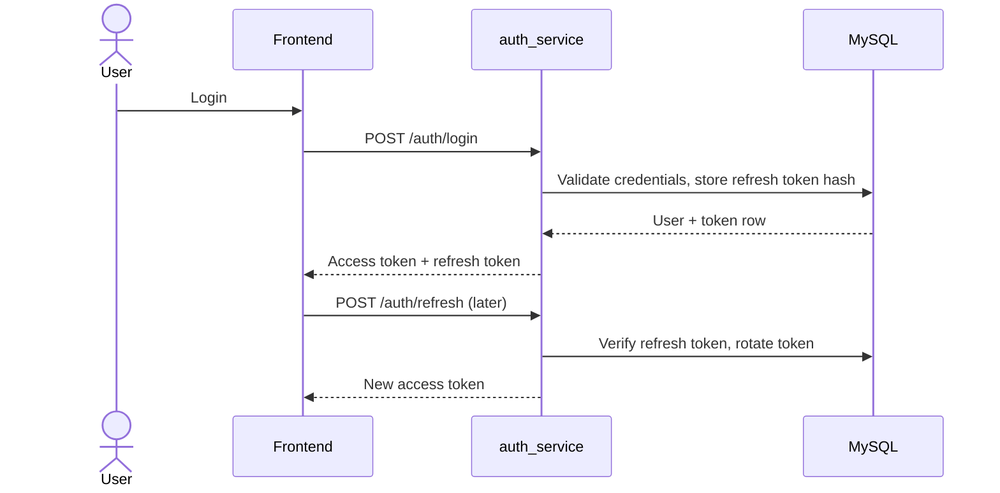

### `member_profile_service` (`:8002`)
- **Primary responsibility:** member profile CRUD + media metadata + profile search.
- **Owns data:** `members` row model (profile, resume URL/text, structured profile fields).
- **Caches/coordination:** pending profile update and upload-status keys in Redis.
- **Events produced:** `member.update.requested`, `profile.viewed` (analytics + notification inputs).
- **Notable behavior:** profile reads can include pending data for eventual-consistency UX.

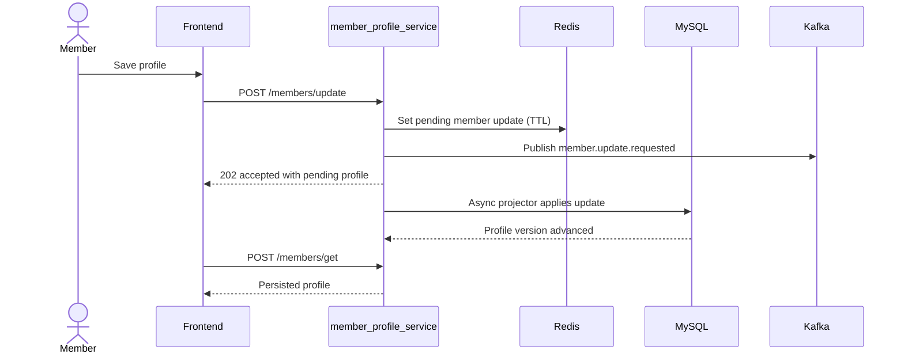

### `recruiter_company_service` (`:8003`)
- **Primary responsibility:** recruiter identity and company profile metadata.
- **Owns data:** `recruiters`, `companies`.
- **Key APIs:** `/recruiters/create|get|update|publicGet`, `/companies/create`.
- **Usage:** source of truth for recruiter-company mapping used by jobs and recruiter UI.

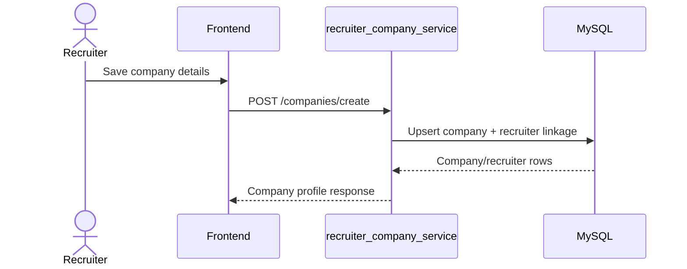

### `jobs_service` (`:8004`)
- **Primary responsibility:** job lifecycle and discovery/search.
- **Owns data:** `jobs`, `saved_jobs`.
- **Query features:** FULLTEXT title/location search, salary range filters, recruiter-owned listing.
- **Caching:** job detail/search count caches in Redis.
- **Events produced:** `job.created`, `job.updated`, `job.closed`, `job.saved`.

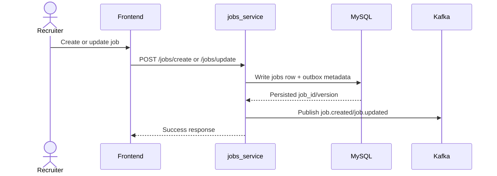

### `applications_service` (`:8005`)
- **Primary responsibility:** async application intake + recruiter application operations.
- **Owns data:** `applications`, `application_notes`, application-related `outbox_events`.
- **Key APIs:** `/applications/submit` (async 202), `/applications/byJob`, `/applications/byMember`, `/applications/updateStatus`.
- **Reliability model:** idempotency + outbox to avoid dropped status/event transitions.
- **Events produced:** `application.submit.requested`, `application.submitted`, `application.status.updated`.

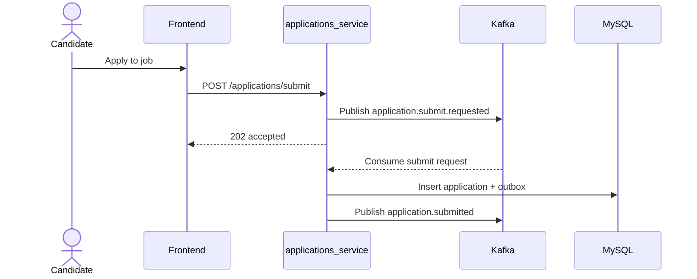

### `messaging_connections_service` (`:8006`)
- **Primary responsibility:** messaging (threads/messages) and social graph actions.
- **Owns data:** Mongo collections `threads`, `messages`, `connection_requests`, `connections`.
- **Key APIs:** `/threads/open`, `/messages/send`, `/connections/request|accept|reject|withdraw|remove`.
- **Event outputs:** `message.sent`, `connection.requested|accepted|rejected`.
- **Design choice:** document model for thread/message fanout and timeline reads.

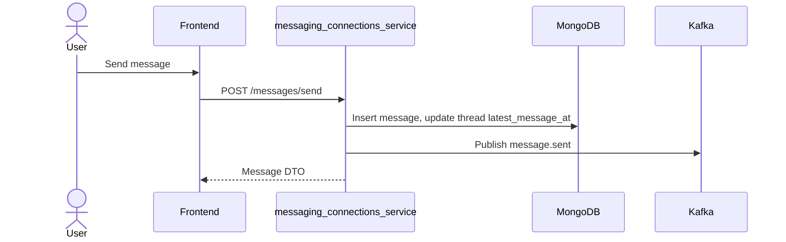

### `analytics_service` (`:8007`)
- **Primary responsibility:** analytics ingestion + materialized rollups + dashboard query APIs.
- **Owns data:** Mongo `events`, `events_rollup`, `benchmarks`.
- **Caching:** Redis `analytics:*` query response cache.
- **Current behavior updates:** recruiter charts scoped to recruiter-owned jobs; member status chart uses latest status per application.
- **Key APIs:** `/events/ingest`, `/analytics/jobs/top`, `/analytics/funnel`, `/analytics/geo`, `/analytics/member/dashboard`, `/benchmarks/*`.

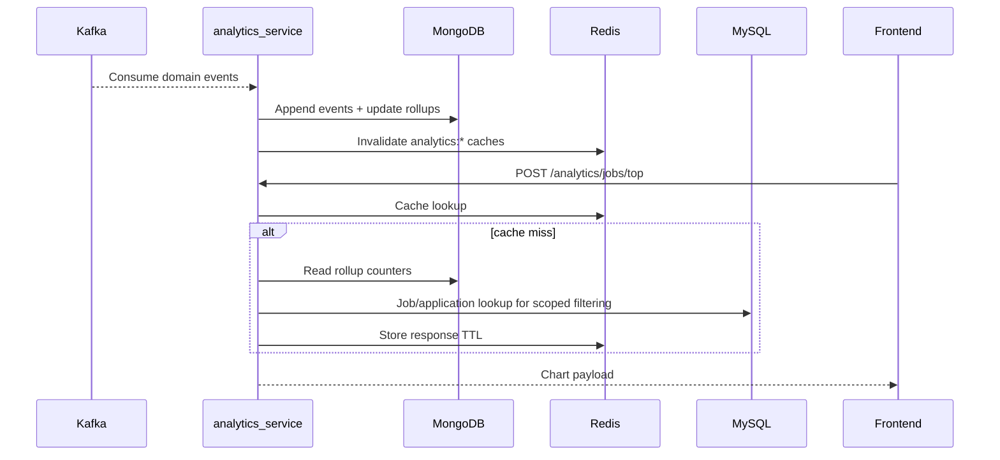

### `ai_orchestrator_service` (`:8008`)
- **Primary responsibility:** AI task orchestration for recruiter copilot and member career coach.
- **Owns data:** Mongo `ai_tasks`, `ai_task_steps`; uses Redis task snapshots for low-latency polling.
- **Read dependencies:** jobs/members/applications from MySQL-backed repositories.
- **LLM integration:** OpenRouter (when key present), fallback to embedding/rules baseline.
- **Event outputs:** AI task and decision events (`ai.results`, task lifecycle updates).

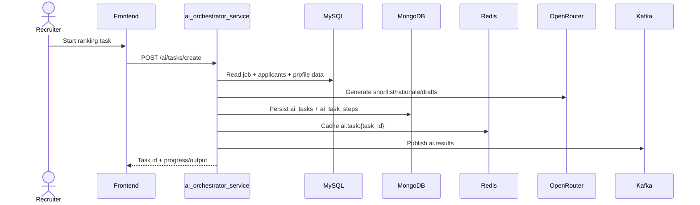

## Data Storage Architecture

### MySQL Schema (Transactional / Relational)

Primary entities:
- Identity: `users`, `refresh_tokens`, `idempotency_keys`
- Profiles/org: `members`, `recruiters`, `companies`
- Hiring core: `jobs`, `applications`, `saved_jobs`, `application_notes`
- Reliability: `outbox_events`
- Reporting views: `recruiter_job_counts`, `member_application_counts`

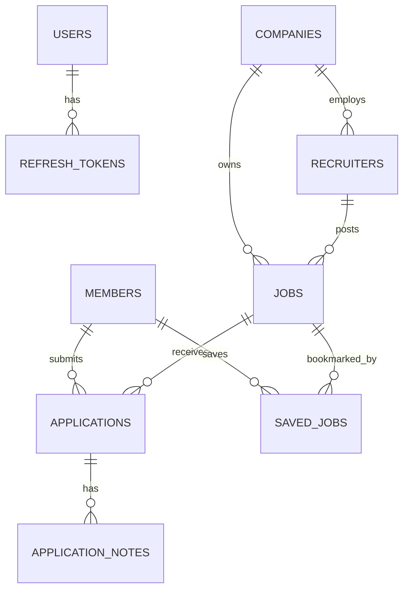

Important indexing/features:
- `idx_jobs_recruiter`, `idx_jobs_status`, `idx_jobs_created_at`
- `idx_applications_member`, `idx_applications_job`, `idx_applications_status`
- FULLTEXT index `ft_jobs_title_location` on `jobs(title, location_text)`
- Salary columns on jobs: `salary_min`, `salary_max`, `salary_currency`

### MongoDB Schema (Event + Document Workloads)

Database: `linkedin_sim_docs` with collections:
- Messaging: `threads`, `messages`, `connection_requests`, `connections`
- Analytics/eventing: `events`, `events_rollup`, `benchmarks`
- AI orchestration: `ai_tasks`, `ai_task_steps`
- Auxiliary reliability: `outbox_events` (document-mode outbox path)

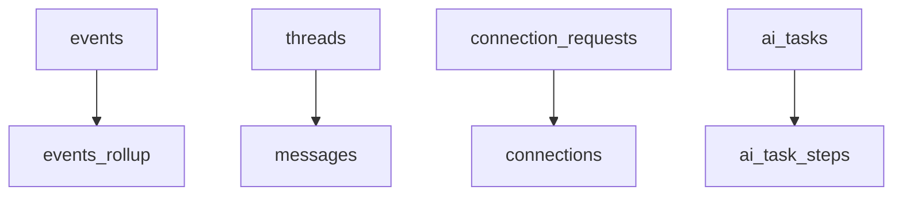

### Redis Usage (Cache / Ephemeral Coordination)

Key families currently used:
- `analytics:*` -> cached analytics responses (`jobs/top`, `funnel`, `geo`, `member/dashboard`, benchmarks).
- `ai:task:{task_id}` -> short-lived AI orchestration task snapshots for UI polling.
- `coach_hist:{member_id}` -> cached career coach suggestion history.
- `jobs:search:count:v2:{hash}` -> cached job search total counts.
- `job:detail:{job_id}` / `job:pending:detail:{job_id}` -> job detail and pending read states.
- `member:pending:update:{member_id}` (via member route helpers) -> pending profile update state.
- Upload-status keys for async media processing in member profile flow.

Why Redis exists in this architecture:
- Reduce repeated expensive read aggregation (analytics, counts, task hydration).
- Keep UI-responsive state for async workflows without writing every transient step to SQL.
- Provide bounded TTL caches that are invalidated on new events (`delete_pattern('analytics:*')`, etc.).

## What's Implemented

### Core Services
| Service | Port | Key Endpoints |
|---------|------|---------------|
| auth_service | 8001 | /auth/register, /auth/login, /auth/refresh, /auth/logout |
| member_profile_service | 8002 | /members/create, get, update, search |
| recruiter_company_service | 8003 | /recruiters/create, get, update; /companies/create |
| jobs_service | 8004 | /jobs/create, get, update, close, search, byRecruiter, save |
| applications_service | 8005 | /applications/submit (202 async), get, byJob, byMember, updateStatus |
| messaging_connections_service | 8006 | /threads/open, /messages/send, /connections/request, accept, reject |
| analytics_service | 8007 | /analytics/jobs/top, funnel, geo, member/dashboard, /benchmarks/report |
| ai_orchestrator_service | 8008 | /ai/tasks/create, approve, reject; /ai/coach/suggest; /ai/analytics/approval-rate |

### Frontend Pages
- **Jobs** — search, salary filter, save, apply (Kafka-first async)
- **Job Detail** — resume upload/paste + apply
- **Member Profile** — edit skills, headline, resume
- **Applications** — status tracking (submitted -> reviewing -> interview -> offer/rejected)
- **Messaging** — threads + real-time send
- **Connections** — request, accept, withdraw
- **Notifications** — live badge count (polls every 10s), mark-as-read
- **Recruiter Dashboard** — post/edit/close jobs, view applicants, update status, scoped analytics charts
- **AI Dashboard** — shortlist candidates, approve/edit/reject outreach drafts
- **Career Coach** — match score, suggested headline, skills to add, resume tips (OpenRouter LLM)
- **Analytics** — recruiter metrics, member activity, performance benchmarks tab

### Key Features
- **Kafka-first submit** — application submit is fully async; HTTP 202 returned immediately
- **Salary filter** — `salary_min` / `salary_max` columns + search filter (Person 3)
- **FULLTEXT search** — MySQL FULLTEXT index on `jobs(title, location_text)` (Person 3)
- **AI Career Coach** — `POST /ai/coach/suggest` scores profile vs job and suggests improvements (Person 2)
- **Application funnel** — Viewed -> Saved -> Started -> Submitted per job (dropdown selector)
- **Geo chart** — city-wise applications per job (dropdown selector)
- **Recruiter-scoped analytics** — hiring charts limited to the recruiter's posted jobs
- **Correct member status charting** — pie chart reflects latest status per application
- **Exception handling** — duplicate email 409, duplicate application 409, closed job 409, DLQ
- **Idempotency** — all write endpoints accept `Idempotency-Key` header
- **RS256 JWT** — auth_service issues; all services validate offline via JWKS

---

## Quick Start (Local)

### 1. Clone & configure

```bash
git clone https://github.com/Nikhil-Khaneja/Linkedin_Prototype_LLM_Agent_Microservices.git
cd Linkedin_Prototype_LLM_Agent_Microservices
cp .env.example .env
# Edit .env: set OPENROUTER_API_KEY for AI Coach (optional but recommended)
```

### 2. Start all services

```bash
docker compose up -d
# Wait ~60s for all health checks
docker compose ps   # all 17 should show healthy/Up
```

### 3. Apply schema & seed data

```bash
bash scripts/bootstrap_local.sh          # migrations + Kafka topics
/opt/homebrew/bin/python3 scripts/seed_demo_data.py   # creates demo accounts + seed jobs
/opt/homebrew/bin/python3 scripts/load_kaggle_datasets.py --synthetic  # loads 10k jobs + 5k members
```

### 4. Open the app

| URL | What |
|-----|------|
| http://localhost:5173 | Frontend |
| http://localhost:3000 | Grafana (admin/admin) |
| http://localhost:9000 | MinIO (minioadmin/minioadmin) |
| http://localhost:8001/docs | Auth service Swagger |

---

## Demo Accounts

| Role | Email | Password |
|------|-------|----------|
| Member | ava@example.com | StrongPass#1 |
| Recruiter | recruiter@example.com | RecruiterPass#1 |

---

## Performance Benchmarks (Person 4)

```bash
# Run all 4 configs (requires full stack running):
/opt/homebrew/bin/python3 scripts/run_performance_benchmarks.py --all

# Or individual config:
/opt/homebrew/bin/python3 scripts/run_performance_benchmarks.py --config "B+S+K"
```

Results stored in analytics_service → visible in **Analytics → Performance & benchmarks** tab.

| Config | Description |
|--------|-------------|
| B | Baseline — no Redis, no Kafka |
| B+S | Base + Redis cache |
| B+S+K | Base + Redis + Kafka (default stack) |
| B+S+K+Other | Base + Redis + Kafka + scaled replicas |

---

## Ops Endpoints

Every service exposes:
```
GET /ops/healthz      → {"status": "ok", "service": "...", "version": "..."}
GET /ops/cache-stats  → {"lookups": n, "hits": n, "misses": n, "hit_rate": 0.xx}
GET /ops/metrics      → Prometheus text format
```

---

## Tests

```bash
# Compile check:
python3 -m compileall backend

# API smoke tests:
/opt/homebrew/bin/python3 -m pytest tests/api -q -p no:deepeval
```

---

## Project Structure

```
├── backend/
│   └── services/
│       ├── shared/              # JWT, Kafka bus, Redis cache, repositories
│       ├── auth_service/
│       ├── member_profile_service/
│       ├── recruiter_company_service/
│       ├── jobs_service/
│       ├── applications_service/
│       ├── messaging_connections_service/
│       ├── analytics_service/
│       └── ai_orchestrator_service/
├── frontend/
│   └── src/pages/               # React pages (Jobs, Profile, Coach, Analytics, …)
├── infra/
│   ├── mysql/                   # 001–006 migration files
│   └── mongo/                   # MongoDB init
├── deploy/
│   └── aws_accounts/            # Per-owner docker-compose.aws.yml + ECS task defs
├── infra/aws/                   # Terraform (VPC, ALB, ECS, RDS, ElastiCache, ECR)
├── scripts/                     # bootstrap, seed, load_kaggle_datasets, benchmarks
├── tests/
│   ├── api/                     # pytest smoke tests
│   └── jmeter/                  # scenario_a.jmx, scenario_b.jmx
├── observability/               # Prometheus, Grafana, Promtail config
└── docs/
    ├── LOCAL_SETUP_RUNBOOK.md   # Step-by-step local setup guide
    ├── PERFORMANCE_ANALYSIS.md  # Benchmark results write-up
    ├── architecture.md
    └── aws_deploy_step_by_step.md
```

---

## AWS Deployment

Terraform infrastructure in `infra/aws/`:
- VPC + subnets + security groups
- ALB with path-based routing
- ECS Fargate (8 backend services + frontend)
- RDS MySQL, ElastiCache Redis, DocumentDB, ECR

Per-owner EC2 deployment configs in `deploy/aws_accounts/` (owner1–owner9).

```bash
cd infra/aws
terraform init && terraform apply
bash push_images.sh    # build + push ECR images
bash deploy.sh         # register task defs + update ECS services
```

---

## Local Setup Runbook

See `docs/LOCAL_SETUP_RUNBOOK.md` for the complete step-by-step guide to reproduce the full local stack from scratch.
