# LinkedIn Simulation — Distributed Systems Class Project

Full-stack LinkedIn clone built as a distributed systems course project. Eight FastAPI microservices, React frontend, Kafka-first async flows, Redis caching, MySQL + MongoDB persistence, AI Career Coach, and JMeter performance benchmarks.

---

## Team

- Dhruv
- Nikhil
- Sanjay
- Viraat
- Shreya
- Drashti
- Charvee
- Shriram

---

## Architecture

## Current State (May 2026)

- Recruiter hiring charts are now recruiter-scoped (top jobs/views/saves only for jobs posted by that recruiter).
- Member "Applications by status" pie chart now uses latest status per application (no multi-count inflation across transitions).
- AI ranked candidate "character chip" issue fixed by normalizing list-like fields from LLM payloads.
- Resume/media links normalized for HTTPS/ALB routing in recruiter and profile pages.
- Navigation cleanup done (removed `Home` and `Perf` entries from top nav).

## High-Level System Diagram

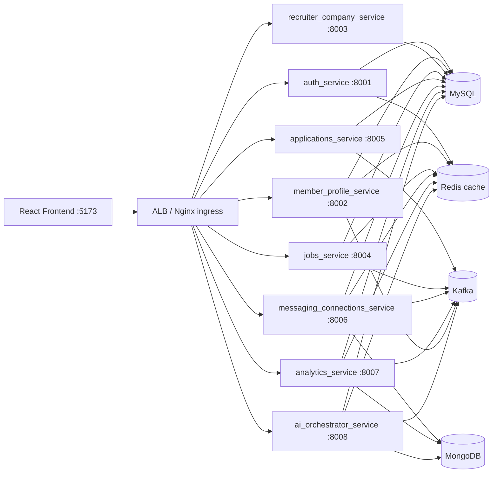

**Kafka-first example path:**
`POST /applications/submit` -> emit `application.submit.requested` -> async consumer persists application -> emit `application.submitted` -> analytics rollups update -> UI reads from query APIs.

## Service Catalog (Detailed)

### `auth_service` (`:8001`)
- **Primary responsibility:** identity and session lifecycle.
- **Owns data:** `users`, `refresh_tokens`.
- **Key APIs:** `/auth/register`, `/auth/login`, `/auth/refresh`, `/auth/logout`, `/auth/me`.
- **Security contract:** issues RS256 JWTs; other services validate tokens offline using JWKS/public key.
- **Failure boundary:** auth failures are isolated; downstream services return `401`/`403` without calling auth synchronously.

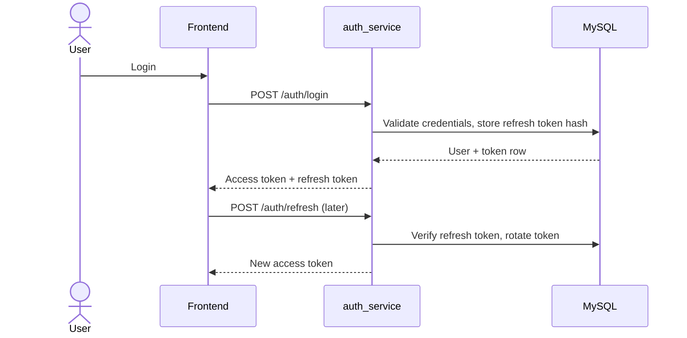

### `member_profile_service` (`:8002`)
- **Primary responsibility:** member profile CRUD + media metadata + profile search.
- **Owns data:** `members` row model (profile, resume URL/text, structured profile fields).
- **Caches/coordination:** pending profile update and upload-status keys in Redis.
- **Events produced:** `member.update.requested`, `profile.viewed` (analytics + notification inputs).
- **Notable behavior:** profile reads can include pending data for eventual-consistency UX.

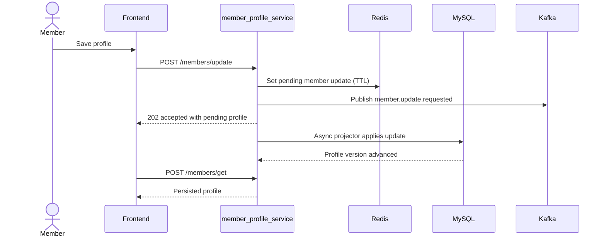

### `recruiter_company_service` (`:8003`)
- **Primary responsibility:** recruiter identity and company profile metadata.
- **Owns data:** `recruiters`, `companies`.
- **Key APIs:** `/recruiters/create|get|update|publicGet`, `/companies/create`.
- **Usage:** source of truth for recruiter-company mapping used by jobs and recruiter UI.

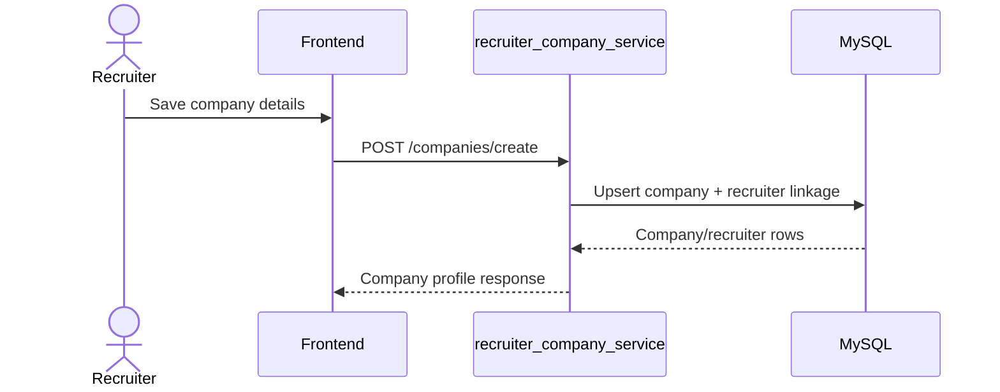

### `jobs_service` (`:8004`)
- **Primary responsibility:** job lifecycle and discovery/search.
- **Owns data:** `jobs`, `saved_jobs`.
- **Query features:** FULLTEXT title/location search, salary range filters, recruiter-owned listing.
- **Caching:** job detail/search count caches in Redis.
- **Events produced:** `job.created`, `job.updated`, `job.closed`, `job.saved`.

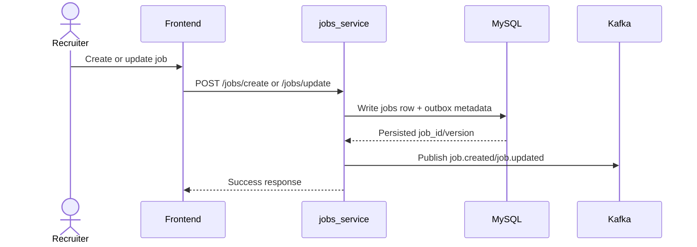

### `applications_service` (`:8005`)
- **Primary responsibility:** async application intake + recruiter application operations.
- **Owns data:** `applications`, `application_notes`, application-related `outbox_events`.
- **Key APIs:** `/applications/submit` (async 202), `/applications/byJob`, `/applications/byMember`, `/applications/updateStatus`.
- **Reliability model:** idempotency + outbox to avoid dropped status/event transitions.
- **Events produced:** `application.submit.requested`, `application.submitted`, `application.status.updated`.

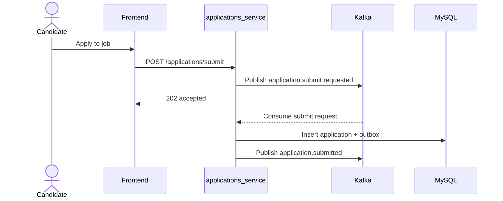

### `messaging_connections_service` (`:8006`)
- **Primary responsibility:** messaging (threads/messages) and social graph actions.
- **Owns data:** Mongo collections `threads`, `messages`, `connection_requests`, `connections`.
- **Key APIs:** `/threads/open`, `/messages/send`, `/connections/request|accept|reject|withdraw|remove`.
- **Event outputs:** `message.sent`, `connection.requested|accepted|rejected`.
- **Design choice:** document model for thread/message fanout and timeline reads.

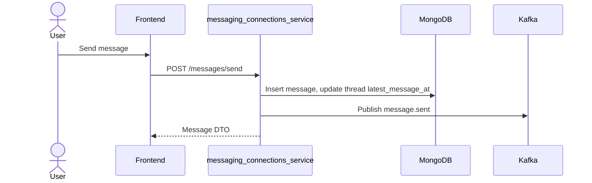

### `analytics_service` (`:8007`)
- **Primary responsibility:** analytics ingestion + materialized rollups + dashboard query APIs.
- **Owns data:** Mongo `events`, `events_rollup`, `benchmarks`.
- **Caching:** Redis `analytics:*` query response cache.
- **Current behavior updates:** recruiter charts scoped to recruiter-owned jobs; member status chart uses latest status per application.
- **Key APIs:** `/events/ingest`, `/analytics/jobs/top`, `/analytics/funnel`, `/analytics/geo`, `/analytics/member/dashboard`, `/benchmarks/*`.

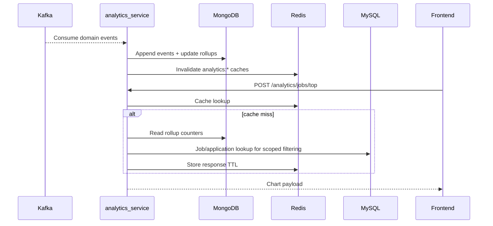

### `ai_orchestrator_service` (`:8008`)
- **Primary responsibility:** AI task orchestration for recruiter copilot and member career coach.
- **Owns data:** Mongo `ai_tasks`, `ai_task_steps`; uses Redis task snapshots for low-latency polling.
- **Read dependencies:** jobs/members/applications from MySQL-backed repositories.
- **LLM integration:** OpenRouter (when key present), fallback to embedding/rules baseline.
- **Event outputs:** AI task and decision events (`ai.results`, task lifecycle updates).

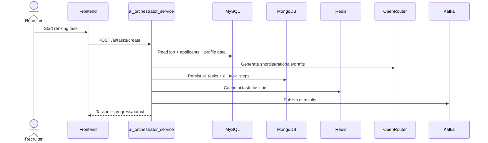

## Data Storage Architecture

### MySQL Schema (Transactional / Relational)

Primary entities:
- Identity: `users`, `refresh_tokens`, `idempotency_keys`
- Profiles/org: `members`, `recruiters`, `companies`
- Hiring core: `jobs`, `applications`, `saved_jobs`, `application_notes`
- Reliability: `outbox_events`
- Reporting views: `recruiter_job_counts`, `member_application_counts`

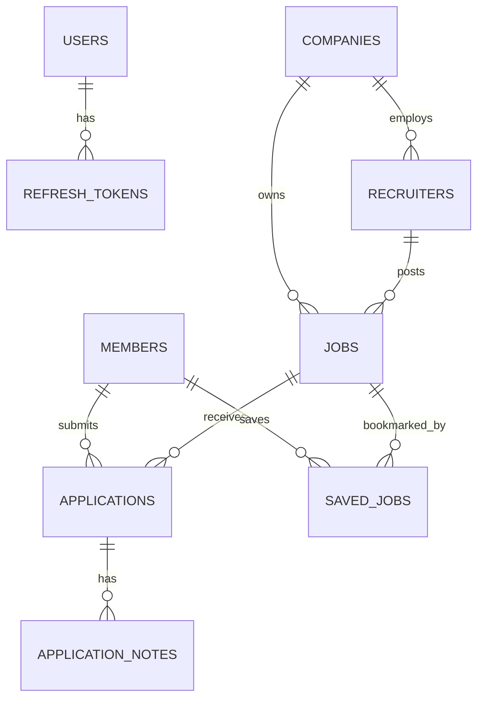

Important indexing/features:
- `idx_jobs_recruiter`, `idx_jobs_status`, `idx_jobs_created_at`
- `idx_applications_member`, `idx_applications_job`, `idx_applications_status`
- FULLTEXT index `ft_jobs_title_location` on `jobs(title, location_text)`
- Salary columns on jobs: `salary_min`, `salary_max`, `salary_currency`

### MongoDB Schema (Event + Document Workloads)

Database: `linkedin_sim_docs` with collections:
- Messaging: `threads`, `messages`, `connection_requests`, `connections`
- Analytics/eventing: `events`, `events_rollup`, `benchmarks`
- AI orchestration: `ai_tasks`, `ai_task_steps`
- Auxiliary reliability: `outbox_events` (document-mode outbox path)

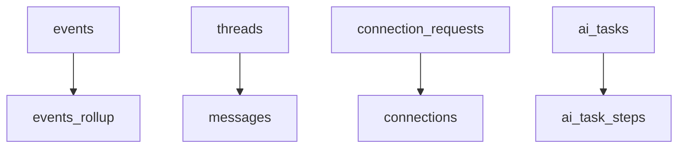

### Redis Usage (Cache / Ephemeral Coordination)

Key families currently used:
- `analytics:*` -> cached analytics responses (`jobs/top`, `funnel`, `geo`, `member/dashboard`, benchmarks).
- `ai:task:{task_id}` -> short-lived AI orchestration task snapshots for UI polling.
- `coach_hist:{member_id}` -> cached career coach suggestion history.
- `jobs:search:count:v2:{hash}` -> cached job search total counts.
- `job:detail:{job_id}` / `job:pending:detail:{job_id}` -> job detail and pending read states.
- `member:pending:update:{member_id}` (via member route helpers) -> pending profile update state.
- Upload-status keys for async media processing in member profile flow.

Why Redis exists in this architecture:
- Reduce repeated expensive read aggregation (analytics, counts, task hydration).
- Keep UI-responsive state for async workflows without writing every transient step to SQL.
- Provide bounded TTL caches that are invalidated on new events (`delete_pattern('analytics:*')`, etc.).

## What's Implemented

### Core Services
| Service | Port | Key Endpoints |
|---------|------|---------------|
| auth_service | 8001 | /auth/register, /auth/login, /auth/refresh, /auth/logout |
| member_profile_service | 8002 | /members/create, get, update, search |
| recruiter_company_service | 8003 | /recruiters/create, get, update; /companies/create |
| jobs_service | 8004 | /jobs/create, get, update, close, search, byRecruiter, save |
| applications_service | 8005 | /applications/submit (202 async), get, byJob, byMember, updateStatus |
| messaging_connections_service | 8006 | /threads/open, /messages/send, /connections/request, accept, reject |
| analytics_service | 8007 | /analytics/jobs/top, funnel, geo, member/dashboard, /benchmarks/report |
| ai_orchestrator_service | 8008 | /ai/tasks/create, approve, reject; /ai/coach/suggest; /ai/analytics/approval-rate |

### Frontend Pages
- **Jobs** — search, salary filter, save, apply (Kafka-first async)
- **Job Detail** — resume upload/paste + apply
- **Member Profile** — edit skills, headline, resume
- **Applications** — status tracking (submitted -> reviewing -> interview -> offer/rejected)
- **Messaging** — threads + real-time send
- **Connections** — request, accept, withdraw
- **Notifications** — live badge count (polls every 10s), mark-as-read
- **Recruiter Dashboard** — post/edit/close jobs, view applicants, update status, scoped analytics charts
- **AI Dashboard** — shortlist candidates, approve/edit/reject outreach drafts
- **Career Coach** — match score, suggested headline, skills to add, resume tips (OpenRouter LLM)
- **Analytics** — recruiter metrics, member activity, performance benchmarks tab

### Key Features
- **Kafka-first submit** — application submit is fully async; HTTP 202 returned immediately
- **Salary filter** — `salary_min` / `salary_max` columns + search filter (Person 3)
- **FULLTEXT search** — MySQL FULLTEXT index on `jobs(title, location_text)` (Person 3)
- **AI Career Coach** — `POST /ai/coach/suggest` scores profile vs job and suggests improvements (Person 2)
- **Application funnel** — Viewed -> Saved -> Started -> Submitted per job (dropdown selector)
- **Geo chart** — city-wise applications per job (dropdown selector)
- **Recruiter-scoped analytics** — hiring charts limited to the recruiter's posted jobs
- **Correct member status charting** — pie chart reflects latest status per application
- **Exception handling** — duplicate email 409, duplicate application 409, closed job 409, DLQ
- **Idempotency** — all write endpoints accept `Idempotency-Key` header
- **RS256 JWT** — auth_service issues; all services validate offline via JWKS

---

## Local Run (Docker Compose)

### 1) Clone and configure

```bash
git clone https://github.com/Nikhil-Khaneja/Linkedin_Prototype_LLM_Agent_Microservices.git
cd Linkedin_Prototype_LLM_Agent_Microservices
cp .env.example .env
# Optional but recommended for AI features:
# OPENROUTER_API_KEY=...
```

### 2) Start the full local stack

```bash
docker compose up -d
docker compose ps
```

### 3) Initialize schema + core demo data

```bash
bash scripts/bootstrap_local.sh
python3 scripts/seed_demo_data.py
```

### 4) (Optional) Load larger datasets

```bash
# Synthetic bulk loader
python3 scripts/load_kaggle_datasets.py --synthetic

# Or CSV-based loaders
python3 scripts/bulk_seed_datasets.py jobs --csv ./data/kaggle/job_postings.csv --jobs 10000 --recruiters 500 --run-id local1
python3 scripts/bulk_seed_datasets.py members --csv ./data/kaggle_download/Resume/Resume.csv --members 1000 --run-id local1
python3 scripts/bulk_seed_datasets.py applications --run-id local1 --per-member 10
python3 scripts/mongo_seed_demo.py --member-id mem_1 --count 20
```

### 5) Open local URLs

| URL | What |
|-----|------|
| `http://localhost:5173` | Frontend |
| `http://localhost:8001/docs` | Auth Swagger |
| `http://localhost:3000` | Grafana (`admin/admin`) |
| `http://localhost:9000` | MinIO API |
| `http://localhost:9001` | MinIO console |

## Demo Accounts

| Role | Email | Password |
|------|-------|----------|
| Member | `ava@example.com` | `StrongPass#1` |
| Recruiter | `recruiter@example.com` | `RecruiterPass#1` |

---

## CI/CD Pipeline (GitHub Actions -> ECS EC2)

Workflow: `.github/workflows/deploy-ecs-ec2.yml`

What it does on `push` to `main` and manual `workflow_dispatch`:
1. Assumes AWS role using GitHub OIDC (`AWS_ROLE_ARN` variable).
2. Applies path filters to pick affected services.
3. Builds/pushes Docker images to ECR:
   - Per-service backend images (`linkedin-sim/<service>`)
   - Frontend image
   - Platform images (`mysql`, `mongo`, `kafka-topics-viewer`)
4. Renders ECS task definitions via `infra/ecs-ec2/render_taskdefs.py`.
5. Deploys selected services via `infra/ecs-ec2/deploy_services.py`.

Deployment selection behavior:
- `ALL_APPS` (default): rolls frontend + app services, keeps platform data-plane running.
- `ALL_WITH_PLATFORM`: also redeploys platform task (MySQL/Mongo/Redis/Kafka/MinIO).
- Manual run has checkbox `deploy_platform` to include data plane.

Required GitHub **Variables**:
- `AWS_REGION`, `AWS_ROLE_ARN`, `ECS_CLUSTER`
- `APP_HOST`, `ECS_HOST_PRIVATE_IP`
- `ECR_FRONTEND_REPOSITORY`, `ECR_MYSQL_REPOSITORY`, `ECR_MONGO_REPOSITORY`
- Optional: `ECR_KAFKA_VIEWER_REPOSITORY`, `PUBLIC_HTTP_SCHEME`, `REACT_APP_*`

Required GitHub **Secret**:
- `OPENROUTER_API_KEY` (for AI orchestrator LLM calls)

---

## Independent Service Scaling (No Full-System Downtime)

This architecture is designed so each app service can be rolled/scaled independently while the rest of the platform keeps serving traffic.

### Why this works

- Each service runs as its own ECS service (`linkedin-sim-auth`, `linkedin-sim-jobs`, `linkedin-sim-analytics`, etc.).
- CI/CD supports selective deployment via path filters and service selection.
- Data plane (`linkedin-sim-platform`: MySQL/Mongo/Redis/Kafka/MinIO) is separated from app services, so normal app deploys do not bounce databases.
- APIs are stateless at service layer (state in MySQL/Mongo/Redis), which allows horizontal scaling and rolling replacement.

### Safe ways to roll only one service

- **By code path:** push a change under one service folder (for example `backend/services/analytics_service/**`) and CI redeploys only that ECS service.
- **By explicit selection:** run manual workflow and choose deployment mode for apps only; avoid `ALL_WITH_PLATFORM` unless platform/data changes are required.
- **By ECS CLI:** register a new task definition for just one service and update only that ECS service.

### Horizontal scaling without system downtime

For one target service (example: analytics):

```bash
aws ecs update-service \
  --cluster linkedin-sim-ec2 \
  --service linkedin-sim-analytics \
  --desired-count 2 \
  --region us-east-1
```

This increases replica count for only that service. Other services continue running unchanged.

### Rolling update behavior

- ECS replaces tasks gradually (new task starts before old task stops, subject to deployment config/capacity).
- Because traffic is split per service endpoint, temporary churn in one service does not take down unrelated services.
- If a single service deploy fails, roll back that service only; no need to redeploy the entire stack.

### Practical scaling guidance

- Scale read-heavy services first: `jobs_service`, `analytics_service`, `member_profile_service`.
- Keep platform memory headroom before increasing app counts (especially if sharing one EC2 host).
- Use service-level health checks (`/ops/healthz`) and CloudWatch logs to verify a scaled service before further rollouts.

### How the built CI/CD pipeline helps scaling

- **Service-targeted builds:** backend images are built per service target (`auth_service`, `jobs_service`, `analytics_service`, etc.), so scale/deploy changes can be applied to one service artifact without rebuilding a monolith.
- **Path-based selective rollout:** workflow path filters map changed directories to specific ECS services, preventing unnecessary restarts across unaffected services.
- **Apps-only default rollout:** `ALL_APPS` avoids restarting the data plane, which reduces blast radius and keeps MySQL/Mongo/Redis/Kafka stable while scaling app replicas.
- **Manual control for platform changes:** `ALL_WITH_PLATFORM` is explicit; this separation keeps routine scaling/deploy workflows safe for business traffic.
- **Task-definition rendering per service:** `render_taskdefs.py` + `deploy_services.py` register and roll only selected services, enabling independent capacity updates and canary-like staged rollouts.

---

## Challenges Faced (and How We Addressed Them)

### 1) Async correctness with Kafka-first writes
- **Challenge:** eventual consistency windows between `202 Accepted` and downstream persistence confused UI state.
- **Mitigation:** idempotency keys, outbox pattern, pending-state caching, and explicit polling/status endpoints.

### 2) Data consistency across status transitions
- **Challenge:** status analytics overcounted when one application moved through multiple states.
- **Mitigation:** switched member status aggregation to latest-status-per-application logic for dashboard correctness.

### 3) Multi-store complexity (MySQL + Mongo + Redis)
- **Challenge:** choosing the right persistence/caching layer and maintaining coherent read models.
- **Mitigation:** clear ownership boundaries (transactions in MySQL, event/doc workloads in Mongo, ephemeral cache in Redis) and cache invalidation on write/event updates.

### 4) Recruiter-scoped analytics fidelity
- **Challenge:** global rollups appeared in recruiter dashboards, producing misleading charts.
- **Mitigation:** recruiter-aware filtering in analytics APIs and frontend payload scoping by recruiter id.

### 5) ECS single-host resource pressure
- **Challenge:** co-locating platform + all app services on one EC2 host caused memory contention and intermittent service instability.
- **Mitigation:** tuned memory reservations, separated platform vs app rollout behavior, and added explicit scale guidance.

### 6) HTTPS/media URL and mixed-content issues
- **Challenge:** browser blocked media/API calls when UI was HTTPS but backend links remained HTTP with internal ports.
- **Mitigation:** URL normalization in frontend, `PUBLIC_HTTP_SCHEME`/`APP_HOST` controls in CI render, and ALB path-routing guidance.

### 7) AI output shape variability
- **Challenge:** LLM responses returned list fields as strings, causing UI artifacts (character-level chips).
- **Mitigation:** introduced coercion/normalization for list-like fields and reused it across AI orchestration and OpenRouter client paths.

### 8) Deployment blast radius in CI
- **Challenge:** broad deploys unnecessarily restarted stable services and risked avoidable downtime.
- **Mitigation:** path filters, per-service images, selected-service ECS deploy, and data-plane redeploy gated behind explicit selection.

---

## AWS Deployment (ECS on EC2)

This repo currently deploys using `infra/ecs-ec2/*` scripts (AWS CLI + ECS on EC2 bridge mode), not Terraform/Fargate.

### 1) One-time bootstrap (cluster + IAM + EC2 + ECR)

```bash
export AWS_REGION=us-east-1
export PROJECT=linkedin-sim
export CLUSTER=linkedin-sim-ec2
export GITHUB_OWNER=<your-github-owner>
export GITHUB_REPO=Linkedin_Prototype_LLM_Agent_Microservices
# optional: export INSTANCE_TYPE=t3.xlarge

bash infra/ecs-ec2/bootstrap.sh
```

Bootstrap prints:
- EC2 public/private IPs
- OIDC deploy role ARN for GitHub (`AWS_ROLE_ARN`)
- values to copy into GitHub Variables
- key pair/pem path (if auto-created)

### 2) Configure GitHub Variables/Secret

- Add Variables listed in the CI/CD section above.
- Add Secret `OPENROUTER_API_KEY` if AI features are required.

### 3) Trigger first deployment

- Push to `main`, or
- Run workflow manually from Actions tab.

First successful run creates/updates ECS services and task definitions.

### 4) Verify deployment

```bash
curl "http://<APP_HOST>:8001/ops/healthz"
curl "http://<APP_HOST>:8002/ops/healthz"
curl "http://<APP_HOST>:8003/ops/healthz"
curl "http://<APP_HOST>:8004/ops/healthz"
curl "http://<APP_HOST>:8005/ops/healthz"
curl "http://<APP_HOST>:8006/ops/healthz"
curl "http://<APP_HOST>:8007/ops/healthz"
curl "http://<APP_HOST>:8008/ops/healthz"
```

- Frontend: `http://<APP_HOST>`
- Kafka topics viewer: `http://<APP_HOST>:3840` (ensure SG allows inbound TCP 3840)

### 5) Populate AWS data (recommended flow)

Option A: SSH tunnel from laptop

```bash
ssh -i ./linkedin-sim-key.pem -L 3307:127.0.0.1:3306 -L 27018:127.0.0.1:27017 ec2-user@<EC2_PUBLIC_IP>
```

Then in another terminal:

```bash
export MYSQL_HOST=127.0.0.1 MYSQL_PORT=3307 MYSQL_USER=root MYSQL_PASSWORD=root MYSQL_DATABASE=linkedin_sim
export MONGO_URI=mongodb://127.0.0.1:27018

python3 scripts/bulk_seed_datasets.py jobs --csv ./data/kaggle/job_postings.csv --jobs 10000 --recruiters 500 --run-id aws1
python3 scripts/bulk_seed_datasets.py members --csv ./data/kaggle_download/Resume/Resume.csv --members 1000 --run-id aws1
python3 scripts/bulk_seed_datasets.py applications --run-id aws1 --per-member 10
python3 scripts/mongo_seed_demo.py --member-id mem_501 --count 20
```

Option B: run directly on EC2 (better for large loads)

```bash
cd ~/Linkedin_Prototype_LLM_Agent_Microservices
./scripts/bulk_seed_on_ec2_host.sh
```

### 6) Destroy stack (when needed)

```bash
export AWS_REGION=us-east-1
export CLUSTER=linkedin-sim-ec2
bash infra/ecs-ec2/destroy.sh
# optional:
bash infra/ecs-ec2/destroy.sh --delete-ecr
```

---

## Performance Benchmarks (Person 4)

```bash
python3 scripts/run_performance_benchmarks.py --all
# or
python3 scripts/run_performance_benchmarks.py --config "B+S+K"
```

Results are stored via `analytics_service` and shown in **Analytics -> Performance & benchmarks**.

| Config | Description |
|--------|-------------|
| B | Baseline - no Redis, no Kafka |
| B+S | Base + Redis cache |
| B+S+K | Base + Redis + Kafka (default stack) |
| B+S+K+Other | Base + Redis + Kafka + scaled replicas |

---

## Ops Endpoints

Every service exposes:
```
GET /ops/healthz
GET /ops/cache-stats
GET /ops/metrics
```

---

## Tests

```bash
python3 -m compileall backend
python3 -m pytest tests/api -q -p no:deepeval
```

Current test inventory:
- `44` pytest test cases under `tests/` (API + Kafka-focused tests).
- Includes cross-service suites such as:
  - `tests/api/test_end_to_end.py`
  - `tests/api/test_ai_analytics.py`
  - `tests/api/test_career_coach.py`
  - `tests/api/test_service_coverage_matrix.py` (health + core flow coverage for all 8 services)

Run only the service coverage matrix:

```bash
python3 -m pytest tests/api/test_service_coverage_matrix.py -q
```

---

## Project Structure

```
├── backend/
│   └── services/
│       ├── shared/
│       ├── auth_service/
│       ├── member_profile_service/
│       ├── recruiter_company_service/
│       ├── jobs_service/
│       ├── applications_service/
│       ├── messaging_connections_service/
│       ├── analytics_service/
│       └── ai_orchestrator_service/
├── frontend/
├── infra/
│   ├── mysql/
│   ├── mongo/
│   └── ecs-ec2/
├── scripts/
├── tests/
├── observability/
└── docs/
```

## Additional Runbooks

- `infra/ecs-ec2/README.md` -> detailed ECS EC2 bootstrap/deploy/troubleshooting.
- `docs/LOCAL_SETUP_RUNBOOK.md` -> full local setup walkthrough.
